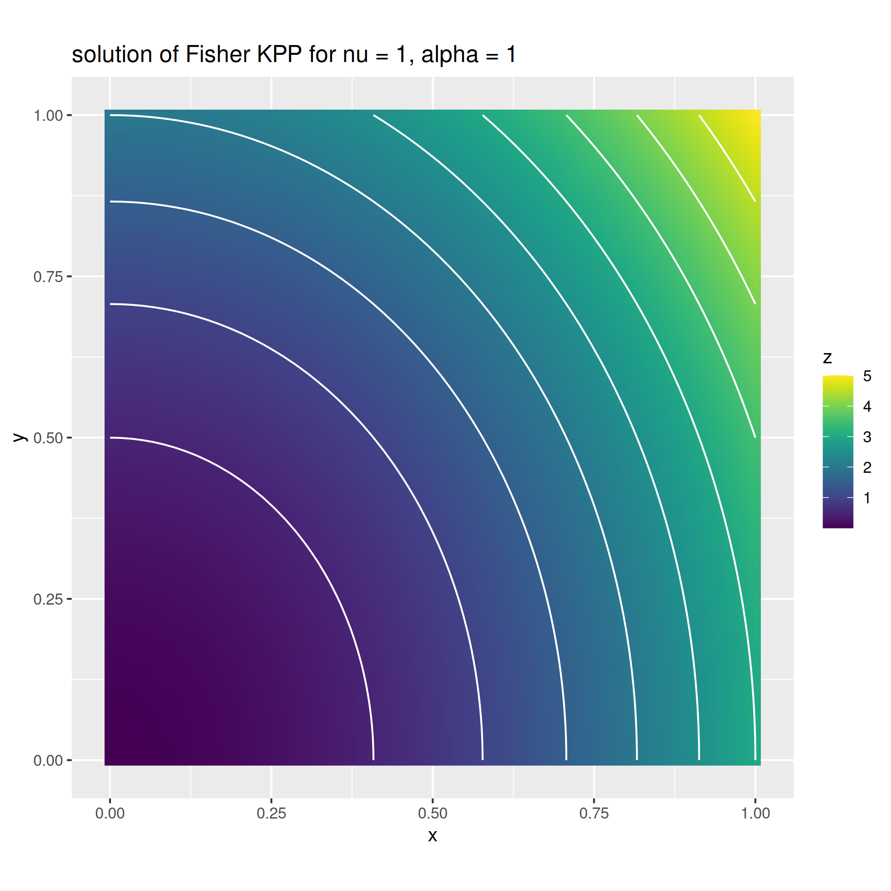

:hide-footer:
:hide-toc:

Example 1: A non-linear diffusion reaction problem
==================================================

In this example we solve a non-linear diffusion reaction problem, corresponding to the stationary case of the Fisher KPP equation. Specifically, the problem is described by the following equation:

.. math::

   \begin{align}
   - \eta \Delta u + \alpha u (1-u) = f & \qquad \text{in } \Omega \\
     u = g & \qquad \text{on } \partial \Omega
   \end{align}

with :math:`\Omega = [0,1]^2`. Being the problem non-linear, to find a solution (which esists unique for :math:`\Omega` Lipschitz and :math:`\eta > 0, \alpha > 0`) we need some iterative scheme which converges, with some reasonable degree of accuracy, to the solution. We here develop a Newton scheme following the work done in :cite:`pacs-gatti-tambu`. Let :math:`\mathcal{L}(u) = -\eta \Delta u + \alpha u(1-u) - f`, the Netwon scheme reads as follow:

.. math::

   \begin{align}
     D \mathcal{L}_{u^k}(h) = -\mathcal{L}(u^k) \\
     u^{k+1} = u^k + h
   \end{align}

being :math:`D \mathcal{L}_{u^k}(h)` the Gateaux derivative of the operator :math:`\mathcal{L}` in the direction :math:`h`. Computations leads to the following expression for the Gateaux derivative (it is not the point of the following example how to compute such functional derivative):

.. math::

   D \mathcal{L}_{u^k}(h) = - \eta \Delta h + \alpha (1 - 2 u^k) h

Substituting the above expression in the Newton formula we obtain the following linearized problem to be solved for :math:`h`

.. math::

   - \eta \Delta h + \alpha (1 - 2 u^k) h = f - (-\eta \Delta u^k + \alpha u^k(1-u^k)).

Finally, observing that by definition of Newton update, :math:`h = u^{k+1} - u^k`, we get the more computationally efficient iteration

.. math::

   - \eta \Delta u^{k+1} + \alpha (1 - 2 u^k) u^{k+1} = f - \alpha (u^k)^2
     
As always, fdaPDE requires the weak formulation of the differential problem above. Following the Galerkin approach, let :math:`V_h` a proper finite dimensional subspace of the space where we seek the solution, and let :math:`u^{k+1}, u^k, v \in V_h`. Multiplying both sides of the last equation by the test function :math:`v` and integrating we recover the following variational identity

.. math::

   \int_{\Omega} \nabla u^{k+1} \cdot \nabla v + \alpha (1-u^k) u^{k+1} v - \int_{\Omega} \alpha u^k u^{k+1} v = \int_{\Omega} f - \alpha (u^k)^2 v \quad \forall v \in V_h

which we iteratively solve for :math:`u^{k+1}` until convergence.

Implementation
--------------

The first step in any finite element code is the definition of the problem geometry. As we are going to iterate several times over the mesh is convinient to compute the cells once and cache them to obtain a fast re-access to the mesh. This option is enabled by activating the cell caching.

.. code-block:: cpp

   Triangulation<2, 2> unit_square = Triangulation<2, 2>::UnitSquare(60, cache_cells);

Once we have a discretization of the domain :math:`\Omega`, we can instatiate a (linear) finite element space on it togheter with trial and test functions.

.. code-block:: cpp

   FeSpace Vh(unit_square, P1<1>); // piecewise linear continuous scalar finite elements
   TrialFunction u(Vh);
   TestFunction  v(Vh);

Because we are dealing with a non-linear problem, we need an object describing the current and previous solution :math:`u^{k+1}` and :math:`u^k`. This is achieved using the :code:`FeFunction` type, which represents a scalar field :math:`u` written with respect to a finite element basis system, e.g. it represents :math:`u(\boldsymbol{p})` as :math:`\sum_{i=1}^N c_i \psi_i(\boldsymbol{p})` given the expansion coefficient vector :math:`\boldsymbol{c} = [c_1, \ldots, c_N]`.

.. code-block:: cpp

   FeFunction u_prev(Vh), solution(Vh);

We now have all the ingredients to assemble our bilinear forms. First we notice that we can save some computational time observing that

.. math::

   - \int_{\Omega} \alpha (u^k)^2 v = \sum_{i=1}^N \sum_{j=1}^N \Biggl[ \int_{\Omega} -\alpha u^k \psi_i \psi_j \Biggr] c_i = A_2 \boldsymbol{c}

being :math:`A_2` the discretization matrix of the bilinear form :math:`b(u, v) = - \int_{\Omega} \alpha u^k u v`, which can therefore be computed once for the lhs and rhs. For this reason, we defined two bilinear forms as follow (look how the writing is almost equivalent to the mathematical one):

.. code-block:: cpp

   auto a = integral(unit_square)(dot(grad(u), grad(v)) + (1 - u_prev) * u * v);
   auto b = integral(unit_square)(-u_prev * u * v);

We then define the forcing term as a plain :code:`ScalarField` togheter with the forcing functional :math:`F(v) = \int_{\Omega} f v`.

.. code-block:: cpp

   ScalarField<2, decltype( {
       return -9*std::pow(p[0], 4) - 12*p[0]*p[0]*p[1]*p[1] + 3*p[0]*p[0] +
               2*p[1]*p[1] - 4*std::pow(p[1], 4) - 10;
   })> f;
   auto F = integral(unit_square, QS2DP4)(f * v);

Observe that we explicitly require an higher order quadrature specifying the quadrature formula :code:`QS2DP4` for the exact integration of order 4 polynomials as second argument of the :code:`integral` function. Finally, we define non-homegeneous Dirichlet boundary conditions :math:`g(\boldsymbol{x}) = 3x^2 + 2y^2` on all the boundary of the domain

.. code-block:: cpp
		
   ScalarField<2, decltype( { return 3 * p[0] * p[0] + 2 * p[1] * p[1]; })> g;
   auto& dof_handler = Vh.dof_handler();
   dof_handler.set_dirichlet_constraint(/* on = */ BoundaryAll, /* data = */ g);

Recall that Dirichlet boundary conditions are implemented as constraints on the degrees of freedom of the linear system :math:`A \boldsymbol{c} = \boldsymbol{b}` deriving form the discretization of the variational problem, and that we must later enforce them on the pair :math:`(A, \boldsymbol{b})` before solving the linear system, using the :code:`enforce_constraints` method.

We can now find an initial point for the Newton scheme. To this end, we solve the linerized problem with initial guess :math:`u = 0`.

.. code-block:: cpp

   u_prev = Eigen::Matrix<double, Dynamic, 1>::Zero(Vh.n_dofs());   // initial guess u = 0
   Eigen::SparseMatrix<double> A = a.assemble();
   Eigen::Matrix<double, Dynamic, 1> v_ = F.assemble();
   dof_handler.enforce_constraints(A, v_);
   // linear system solve A*u_prev = v_ using Cholesky factorization
   Eigen::SimplicialLLT<Eigen::SparseMatrix<double>> lin_solver(A);
   u_prev = lin_solver.solve(v_);
      
The code fragment above effectivelly assemble the discretization matrix :code:`A` for the bilinear form :math:`\int_{\Omega} \nabla u^0 \cdot \nabla v + u^0 v` togheter with the discretizing vector :code:`v_` of the forcing functional :math:`F`. Then, it sets the Dirichlet conditions at the boundary via the :code:`enforce_constaints` method of the :code:`dof_handler` object. Finally, observing that the bilinear form is SPD, solves the FEM linear system using a Cholesky factorization and sets :math:`u^0` to the solution of this linear system.

We can finally start looping until convergence, iteratively solving the recurrence

.. math::

   \int_{\Omega} \nabla u^{k+1} \cdot \nabla v + \alpha (1-u^k) u^{k+1} v - \int_{\Omega} \alpha u^k u^{k+1} v = \int_{\Omega} f - \alpha (u^k)^2 v \quad \forall v \in V_h

.. code-block:: cpp

   while (err > 1e-7) {
      Eigen::SparseMatrix<double> A1 = a.assemble();
      Eigen::SparseMatrix<double> A2 = b.assemble();
      Eigen::Matrix<double, Dynamic, 1> v = v_ + A2 * u_prev.coeff();
      A = A1 + A2;
      dof_handler.enforce_constraints(A, v);
      lin_solver.compute(A);
      solution = lin_solver.solve(v);
	     
      // update error
      err = (u_prev.coeff() - solution.coeff()).norm();
      u_prev = solution;
   }

The code just assembles :code:`A1` and :code:`A2`, updates the right hand side :math:`\int_{\Omega} f - \alpha (u^k)^2 v`, enforces the Dirichlet constaints on the resulting linear system and solves the resulting linear system.
     
.. abstract:: The complete script

   .. code-block:: cpp
      :linenos:

      #include <fdaPDE/finite_elements.h>
      using namespace fdapde;
      
      int main() {
	 // useful typedef and constants definition
	 constexpr int local_dim = 2;
	 using PointT = Eigen::Matrix<double, local_dim, 1>;

	 Triangulation<local_dim, local_dim> unit_square = Triangulation<2, 2>::UnitSquare(60, cache_cells);
	 
         FeSpace Vh(unit_square, P1<1>);
	 // create trial and test functions
	 TrialFunction u(Vh);
	 TestFunction  v(Vh);
	 // current solution and solution at previous step
	 FeFunction u_prev(Vh), solution(Vh);
	 
	 // define bilinear forms
	 auto a = integral(unit_square)(dot(grad(u), grad(v)) + (1 - u_prev) * u * v);
	 auto b = integral(unit_square)(-u_prev * u * v);
	 
	 // define forcing functional
	 ScalarField<2, decltype( {
	     return -9*std::pow(p[0], 4) - 12*p[0]*p[0]*p[1]*p[1] + 3*p[0]*p[0] + 2*p[1]*p[1] - 4*std::pow(p[1], 4) - 10;
	 })> f;
	 auto F = integral(unit_square, QS2DP4)(f * v);
	 
	 // define dirichlet data
	 ScalarField<2, decltype( { return 3 * p[0] * p[0] + 2 * p[1] * p[1]; })> g;
	 auto& dof_handler = Vh.dof_handler();
	 dof_handler.set_dirichlet_constraint(/* on = */ BoundaryAll, /* data = */ g);

	 // Newton scheme initialization (solve linearized problem with initial guess u = 0)
	 u_prev = Eigen::Matrix<double, Dynamic, 1>::Zero(Vh.n_dofs());   // initial guess u = 0
	 Eigen::SparseMatrix<double> A = a.assemble();   // this actually assembles dot(grad(u), grad(v)) + u * v
	 Eigen::Matrix<double, Dynamic, 1> v_ = F.assemble();
	 dof_handler.enforce_constraints(A, v_);
	 // linear system solve A*u_prev = v_ using Cholesky factorization
	 Eigen::SimplicialLLT<Eigen::SparseMatrix<double>> lin_solver(A);
	 u_prev = lin_solver.solve(v_);
    
	 double err = std::numeric_limits<double>::max();
	 while (err > 1e-7) {
	     Eigen::SparseMatrix<double> A1 = a.assemble();
             Eigen::SparseMatrix<double> A2 = b.assemble();
             Eigen::Matrix<double, Dynamic, 1> v = v_ + A2 * u_prev.coeff();    // update rhs
	     A = A1 + A2;
             dof_handler.enforce_constraints(A, v);
             lin_solver.compute(A);
             solution = lin_solver.solve(v);
	     
             // update error
             err = (u_prev.coeff() - solution.coeff()).norm();
             u_prev = solution;
	 }
	 return 0;
      }

.. bibliography:: bibliography.bib
