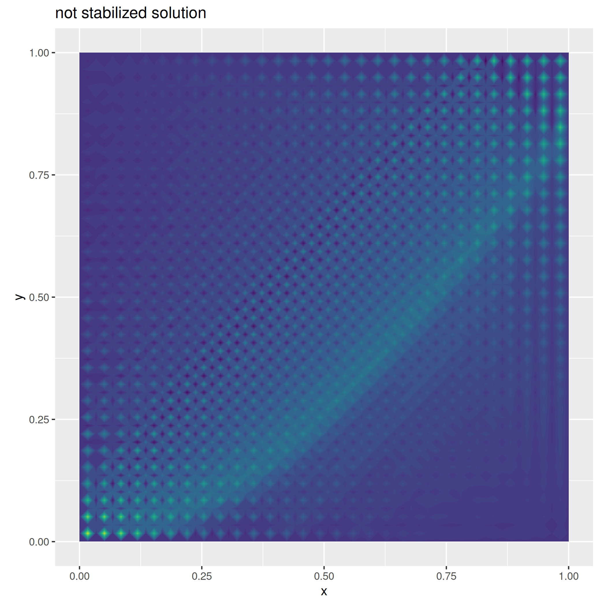
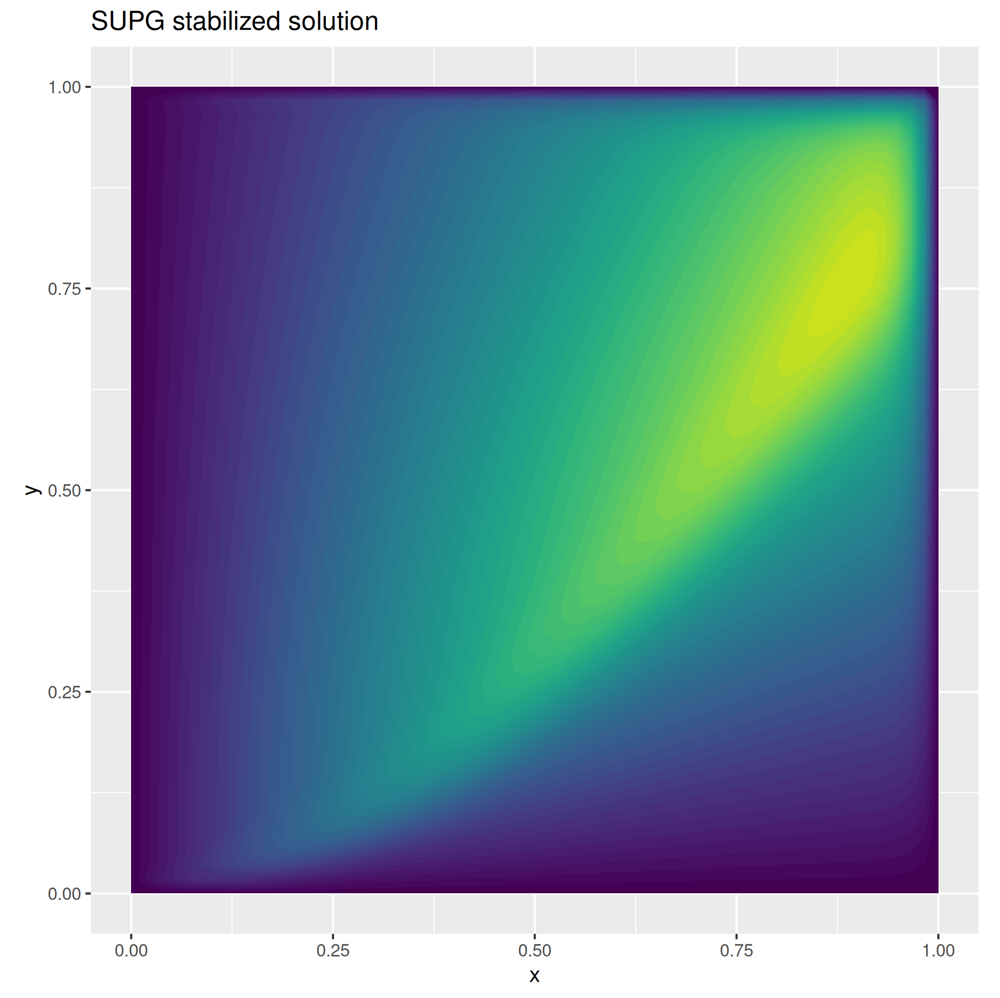

:hide-footer:
:hide-toc:

Example 3: SUPG for advection dominated equations
=================================================

In this tutorial we consider a second order diffusion-transport-reaction equation

.. math::

   \begin{align}
   - \mu \Delta u + \langle b, \nabla u \rangle + u = f & \qquad \text{in } \Omega \\
     u = g & \qquad \text{on } \partial \Omega
   \end{align}

with :math:`\Omega = [0,1]^2` and assuming an advection-dominated regime. Specifically, we set the diffusion coefficient :math:`\mu = 10^{-5}` and we take a non-constant transport field  :math:`b : \Omega \rightarrow \mathbb{R}^2` given by the equation

.. math::

   b = \begin{bmatrix}
   2 y^2 + 1 \\
   2 x
   \end{bmatrix}.

The boundary conditions are set Dirichlet homogeneous over all domain boundary, i.e. :math:`g = 0`. As the Peclet number results bigger than one, numerical stabilization techniques are required to avoid spurious ossilations in the solution. We here analyze the Streamline Upwind Petrov–Galerkin (SUPG) approach, a strongly consistent stabilization method, togheter with its C++ implementation using the C++ fdaPDE-core API.

Let :math:`V` be a proper Sobolev space where the solution has to be searched. Define :math:`a(u, v) = \int_{\Omega} \mu \nabla u \cdot \nabla v + \langle b, \nabla u \rangle v + uv` the bilinear form associated to the weak formulation of the considered problem, and let :math:`F(v) = \int_{\Omega} fv` be the corresponding linear form. Following the usual Galerkin approach, we consider a family of finite dimensional subspaces :math:`V_h` of :math:`V` and search :math:`u_h \in V_h` such that :math:`a(u_h, v_h) = F(v_h)` for any :math:`v_h \in V_h`. Due to the finite-dimensional nature of :math:`V_h`, the problem is typically reduced to solving a linear system. However, in case of advection dominated problems, the direct solution of such linear system results in numerical instabilities. SUPG instead seeks a solution :math:`u_h \in V_h` such that

.. math::

   a(u_h, v_h) + \sum_{k \in T_h} \tau_k \langle Lu_h, b \cdot \nabla v_h \rangle_{L^2(\Omega)} = F(v_h) + \sum_{k \in T_h} \tau_k f (b \cdot \nabla v_h) \quad \forall v_h \in V_h 

where :math:`T_h` is a discretization of the problem domain :math:`\Omega`, :math:`Lu_h` is the PDE in strong formulation and :math:`\tau_k` is a suitably choosen stabilization parameter. The latter is tipically parametrized as follow :math:`\delta \frac{h_k}{2 \| b \|_2}`, where :math:`\delta` is a problem dependent parameter and :math:`h_k` denots the characteristic length (i.e. the diameter) of the :math:`k`-th cell of :math:`T_h`.

As such, define the bilinear form

.. math::

   \tilde a(u_h, v_h) = \int_{\Omega} \bigl[ \mu \nabla u_h \cdot \nabla v_h + \langle b, \nabla u_h \rangle v_h + u_h v_h \bigr] + \sum_{k \in T_h} \tau_k (- \mu \Delta u_h + \langle b, \nabla u_h \rangle + u_h) (b \cdot \nabla v_h)

and the linear form

.. math::

   \tilde F(v_h) = \int_{\Omega} fv_h + \sum_{k \in T_h} \tau_k f (b \cdot \nabla v_h)

then we are required to find :math:`u_h \in V_h` solution of :math:`\tilde a(u_h, v_h) = \tilde F(v_h)` for all :math:`v_h \in V_h`. Using the standard Galerkin argument, we are left to the solution of a linear system resulting from the discretization of :math:`\tilde a(u_h, v_h)` and :math:`\tilde F(v_h)`.

Implementation
--------------

As usual, we start by creating the geometry and the finite element space, togheter with trial and test functions. We also define the non-constant transport field :math:`b` as a :code:`MatrixField`

.. code-block:: cpp

   Triangulation<2, 2> unit_square = Triangulation<2, 2>::UnitSquare(60, cache_cells);

   FeSpace Vh(unit_square, P1<1>);   // piecewise linear continuous scalar finite elements
   TrialFunction u(Vh);
   TestFunction  v(Vh);

   // transport field
   MatrixField<local_dim, local_dim, 1> b;   
   b[0] =  { return std::pow(p[1], 2) + 1; };
   b[1] =  { return 2 * p[0]; };
   // diffusion coefficient
   double mu = 1e-5;

   // forcing term
   ScalarField<2, decltype( { return 1; })> f;
	 
Secondly, we instantiate the integration loops for the bilinear form :math:`a(u,v)` and the linear functional :math:`F(v)` without SUPG correction

.. code-block:: cpp

   auto a = integral(unit_square)(mu * dot(grad(u), grad(v)) + dot(b, grad(u)) * v + u * v);
   auto F = integral(unit_square)(f * v);
   
.. info::

   You don't have to care about the fact that :math:`b` is not a constant. The integrator loops will recognize this fact and silently perform the required actions (i.e., distribute the quadrature nodes on the physical domain and evaluate non-constant coefficients at them) in order to perform the discretization.

We might observe that solving the linear system resulting from the discretization of :code:`a` and :code:`F` alone will result in an unstable solution, as shown in the figure below.

In order to apply SUPG, let us first define the stabilization parameter :math:`\tau_k` and observe that this depends on the cell diameter :math:`h_k`. As such, :math:`\tau_k` will not be a constant during the integration loop. The type :code:`CellDiameterDescriptor` can be used as a placeholder inside an expression to denote :math:`h_k`. During the integration loop, the integrator will take care to substitute, cell by cell, :math:`h_k` with its actual numerical value.

.. code-block:: cpp

   CellDiameterDescriptor h_k(unit_square);
   double delta = 2.85;
   double b_norm = integral(unit_square, QS2DP2)(b.norm());   // transport field norm
   
   auto tau_k  = 0.5 * delta * h_k / b_norm;   // stabilization parameter

.. info::

   We can compute the integral of any expression using the :code:`integral` interface. Provided that the expression does not involve any trial nor test function, :code:`integral(D)(f)` will return the numerical value (as :code:`double`) of :math:`\int_D f`. A quadrature rule is mandatory in this case, as the code cannot deduce any valid quadrature rule from :code:`f` alone.

   In case the domain of integration :code:`D` is a triangulation, only simplex quadrature formulas of the :code:`QS` family are accepted, in which case the integration is performed as

   .. math::

      \int_D f = \sum_{k \in T_h} \int_k f \approx \sum_{k \in T_k} \sum_{q} w_q f(x_q).

   The line of code

   .. code-block:: cpp

      double b_norm = integral(unit_square, QS2DP2)(b.norm());

   in the definition of the stablization parameter computes :math:`\int_{[0,1]^2} \| b \|_2` using a two dimensional 3 point simplex rule (:code:`QS2DP2`).

We have now all the ingredients to assemble the stabilized bilinear forms :math:`\tilde a(u,v)` and :math:`\tilde F(v)`:

.. code-block:: cpp

   auto a_supg =
       a + integral(unit_square)(tau_k * (-mu * (dxx(u) + dyy(u)) + dot(b, grad(u)) + u) * dot(b, grad(v)));
   auto F_supg = F + integral(unit_square)(tau_k * f * dot(b, grad(v)));

.. info::

   The laplace operator in strong form is implemented using second derivative accessors :code:`dxx()` and :code:`dyy()`. In case of :code:`P1` finite elements (or any finite element description whose second derivative is zero), those functions immediately returns 0 and are therefore completely optimized out during the assembly phase.
   
Upon discretization and imposition of boundary conditions, the solution of the discretized linear system provides us with a stabilized solution.
   
.. abstract:: The complete script

   .. code-block:: cpp
      :linenos:

      #include <fdaPDE/finite_elements.h>
      using namespace fdapde;

      int main() {
	 // useful typedef and constants definition
	 constexpr int local_dim = 2;
	 using PointT = Eigen::Matrix<double, local_dim, 1>;

	 Triangulation<local_dim, local_dim> unit_square = Triangulation<2, 2>::UnitSquare(60, cache_cells);

	 FeSpace Vh(unit_square, P1<1>);
	 TrialFunction u(Vh);
	 TestFunction  v(Vh);
	 // transport field
	 MatrixField<local_dim, local_dim, 1> b;
	 b[0] =  { return std::pow(p[1], 2) + 1; };
	 b[1] =  { return 2 * p[0]; };
	 // diffusion coefficent
	 double mu = 1e-5;
	 // forcing term
	 ScalarField<local_dim, decltype( { return 1; })> f;

	 // not stabilized forms
	 auto a = integral(unit_square)(mu * dot(grad(u), grad(v)) + dot(b, grad(u)) * v + u * v);
	 auto F = integral(unit_square)(f * v);
	 
	 // SUPG correction
	 CellDiameterDescriptor h_k(unit_square);
	 double delta = 2.85;
	 double b_norm = integral(unit_square, QS2DP2)(b.norm());   // transport field norm
	 auto tau_k  = 0.5 * delta * h_k / b_norm;   // stabilization parameter
	 auto a_supg = a + integral(unit_square)(tau_k * (-mu * (dxx(u) + dyy(u)) + dot(b, grad(u)) + u) * dot(b, grad(v)));
	 auto F_supg = F + integral(unit_square)(f * v + tau_k * f * dot(b, grad(v)));

	 // homogeneous dirichlet data
	 ScalarField<local_dim, decltype( { return 0; })> g;
	 auto& dof_handler = Vh.dof_handler();
	 dof_handler.set_dirichlet_constraint(/* on = */ BoundaryAll, /* data = */ g);
	 // discretization
	 Eigen::SparseMatrix<double> A = a_supg.assemble();
	 Eigen::Matrix<double, Dynamic, 1> B = F_supg.assemble();
	 dof_handler.enforce_constraints(A, B);
	 // solve step
	 Eigen::SparseLU<Eigen::SparseMatrix<double>> solver(A);
	 Eigen::Matrix<double, Dynamic, 1> solution = solver.solve(B);
	 
	 return 0;
      }
      

	   
